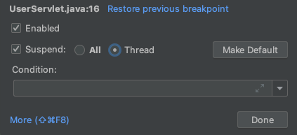
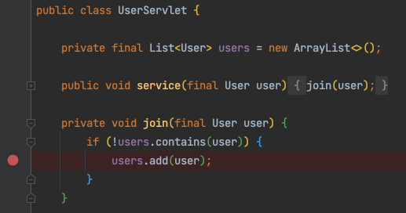

# jwp-hands-on/thread

## 📖 Thread 활용하기

## 학습목표

 * 자바 스레드를 사용해보고 어떤 특징을 가지고 있는지 실습한다.
 * 톰캣의 스레드를 이해하고 설정할 수 있다.
 
## 학습 순서

 * 학습 테스트에서 스레드를 직접 생성해본다.
 * 스레드 간에 상태가 어떻게 공유되는지 확인한다.
 * 임베디드 톰캣의 스레드의 적절한 설정값을 적용한다.

## 실습 요구 사항

 * 스레드를 사용하면서 생길 수 있는 동시성 이슈를 경험해보고 어떻게 해결할 수 있을지 고민해보자.
 * 스프링부트에서 톰캣의 스레드를 설정한다.

##  0단계 - 스레드 이해하기

다음 순서로 학습 클래스의 테스트를 통과시켜보자.
 
 * ThreadTest
 * SynchronizationTest
 * ThreadPoolsTest
 
### ThreadTest

자바에서 스레드란, 프로그램에서 실행되는 스레드를 말한다. JVM을 사용하면 응용 프로그램에서 여러 실행 스레드를 동시에 실행할 수 있다.

모든 스레드에는 우선 순위가 존재한다. 우선 순위가 높은 스레드는 우선 순위가 낮은 스레드보다 우선 실행된다. 각 스레드는 데몬으로 표시될 수도 있고 표시되지 않을 수도 있다. 
일부 스레드에서 실행되는 코드가 새 스레드 객체를 만들 때, 새 스레드는 처음에 생성 스레드의 우선 순위와 동일하게 설정되며, 생성 스레드가 데몬인 경우에만 데몬 스레드가 된다.

> **자바의 데몬 스레드**
> 
> 자바에서 데몬 스레드는 주 스레드의 작업을 돕는 보조적인 역할을 하는 스레드이다.
>  데몬 스레드도 일반 스레드와 다르지 않지만 주 스레드가 종료되면 데몬 스레드는 강제적으로 종료된다는 특징이 있다.
> 데몬 스레드의 예시로는 가비지 컬렉터 등이 있다.

JVM이 시작되면 일반적으로 하나의 `non-daemon` 스레드 (일반적으로 지정된 클래스의 `main 메서드`를 호출)가 있다. 
JVM은 다음 중 하나가 발생할 때 까지 계속 스레드를 실행한다.

 * Runtime 클래스의 `exit()` 메서드가 호출되었으며 security manager가 종료 작업이 수행되도록 허용한다.
 * 호출에서 `run()` 메서드로 돌아가거나 `run()` 메서드로 넘어 전파되는 예외를 발생시킴으로써 데몬 스레드가 아닌 모든 스레드가 죽는다.

#### Thread

새로운 실행 스레드를 만드는 방법은 두 가지가 있다. 하나는 클래스를 `Thread`의 하위 클래스로 선언하는 것이다.
이 하위 클래스는 클래스 스레드의 `run()` 메서드를 `override` 해야 한다. 그 다음 하위 클래스의 인스턴스를 할당하고 시작할 수 있다.

```java
class ThreadTest {
    
    @Test
    void testExtendedThread() throws InterruptedException {
        Thread thread = new ExtendedThread("hello thread");

        thread.start();

        thread.join();
    }

    private static final class ExtendedThread extends Thread {

        private String message;

        public ExtendedThread(final String message) {
            this.message = message;
        }

        @Override
        public void run() {
            log.info(message);
        }
    }    
}
```

 * `new ExtendedThread("hello thread)`: Thread 클래스로 상속하고 스레드 객체를 생성한다.
 * `thread.start()`: 생성한 스레드 객체를 실행한다. Thread 객체의 `run()` 메서드가 실행된다.
 * `thread.join()`: 스레드 작업이 완료될 때 까지 기다린다.

```shell
11:28:47.963 [Thread-0] INFO concurrency.stage0.ThreadTest - hello thread
```

#### Runnable

스레드를 만드는 또 다른 방법은 `Runnable` 인터페이스를 구현하는 클래스를 선언하는 것이다. 그 다음 해당 클래스는 `run()` 메서드를 구현한다. 
그 다음 클래스의 인스턴스를 할당하고 스레드를 만들 때 인수로 전달한 뒤 시작할 수 있다.

```java
class ThreadTest {

    @Test
    void testRunnableThread() throws InterruptedException {
        Thread thread = new Thread(new RunnableThread("hello thread"));

        thread.start();

        thread.join();
    }
    
    private static final class RunnableThread implements Runnable {

        private String message;

        public RunnableThread(final String message) {
            this.message = message;
        }

        @Override
        public void run() {
            log.info(message);
        }
    }
}
```

 * `new Thread(new RunnableThread("hello thread"))`: `Runnable` 인터페이스의 구현체를 만들고 Thread 클래스를 활용하여 스레드 객체를 생성한다.

### SynchronizationTest

다중 스레드 환경에서 두 개 이상의 스레드가 변경 가능한(mutable) 공유 데이터를 동시에 업데이트하면 경쟁 조건`race condition`이 발생한다.
자바는 공유 데이터에 대한 스레드 접근을 동기화 `synchronization`하여 경쟁 조건을 방지한다. 동기화된 블록은 하나의 스레드만 접근하여 실행 할 수 있다.

> **race condition**
> 
> 다수의 프로세스나 스레드가 `공유 자원`을 동시에 읽거나 쓰려고 하는 상태를 의미한다.

자바에서는 `synchronized`를 활용하여 `lock`을 걸어 동기화를 수행한다. 이러한 `synchronized`는 작성한 위치에 따라 적용되는 범위가 달라진다.

```java
class SynchronizationTest {

    @Test
    void testSynchronized() throws InterruptedException {
        var executorService = Executors.newFixedThreadPool(3);
        var synchronizedMethods = new SynchronizedMethods();

        IntStream.range(0, 1000)
                .forEach(count -> executorService.submit(synchronizedMethods::calculate));
        executorService.awaitTermination(500, TimeUnit.MILLISECONDS);

        assertThat(synchronizedMethods.getSum()).isEqualTo(1000);
    }

    private static final class SynchronizedMethods {

        private int sum = 0;

        public synchronized void calculate() {
            setSum(getSum() + 1);
        }

        public int getSum() {
            return sum;
        }

        public void setSum(int sum) {
            this.sum = sum;
        }
    }
}
```

 * `public synchronized void calculate()`: 인스턴스 메서드는 메서드를 소유한 클래스의 `인스턴스`를 통해 동기화된다. 즉, 클래스의 인스턴스당 하나의 스레드만 이 메서드를 실행할 수 있다.

`synchronized`의 다양한 사용법은 [Guide to the Synchronized Keyword in Java](https://www.baeldung.com/java-synchronized)에서 확인할 수 있다.

### ThreadPoolsTest

자바에서 스레드는 운영체제의 리소스인 시스템 수준의 스레드에 매핑된다. 즉, 운영체제의 메모리 공간을 사용한다는 의미이다. 
만약 스레드가 제어할 수 없이 생성 된다면 이러한 리소스는 빠르게 고갈될 것이다.

그렇기 때문에 스레드를 필요할 때 마다 생성하고 수거하는 것은 좋지 않은 결과로 이어질 수 있다. 스레드 풀을 활용하면 미리 스레드를 생성한 뒤 필요할 때마다 생성된
스레드를 재사용하도록 할 수 있다. 정리하면 스레드를 모아둔 풀장과 같다.

스레드 풀을 통해 응용 프로그램이 생성하는 스레드 수와 생명 주기를 제어할 수 있다. 또한 작업 실행을 예약하고 수신 작업을 대기열에 보관할 수 있다.

#### newFixedThreadPool(int nThreads)

제한되지 않은 공유 queue에서 작동하는 `고정 개수`의 스레드를 재사용하는 스레드 풀을 만든다. 어떤 상황에서도 최대 `nThread` 스레드는 활성 처리 작업이다.
모든 스레드가 활성 상태일 때 추가 작업이 제출되면 스레드를 사용할 수 있을 때까지 대기열에서 `대기`한다. 태스크 실행 중 오류로 스레드가 종료된다면
후속 작업이 필요한 경우 새 스레드가 그 자리를 대신한다. 스레드 풀 안에 스레드는 명시적으로 종료될 때 까지 존재한다.

```java
class ThreadPoolsTest {

    @Test
    void testNewFixedThreadPool() {
        final var executor = (ThreadPoolExecutor) Executors.newFixedThreadPool(2);
        executor.submit(logWithSleep("hello fixed thread pools"));
        executor.submit(logWithSleep("hello fixed thread pools"));
        executor.submit(logWithSleep("hello fixed thread pools"));

        final int expectedPoolSize = 2;
        final int expectedQueueSize = 1;

        assertThat(expectedPoolSize).isEqualTo(executor.getPoolSize());
        assertThat(expectedQueueSize).isEqualTo(executor.getQueue().size());
    }

    private Runnable logWithSleep(final String message) {
        return () -> {
            try {
                Thread.sleep(1000);
            } catch (InterruptedException e) {
                throw new RuntimeException(e);
            }
            log.info(message);
        };
    }
}
```

 * `Executors.newFixedThreadPool(2)`: `nThreads`의 개수가 `2개`인 스레드 풀을 생성한다.
 * `final int expectedPoolSize = 2`: 스레드 풀의 스레드 개수는 `2개`이다. 
 * `final int expectedQueueSize = 1`: 스레드 풀에 제출된 태스크는 `3개`이므로 `1개`는 대기열에 남게 된다.

#### newCachedThreadPool()

필요에 따라 새 스레드를 만들지만 이전에 생성된 스레드가 사용 가능할 때 재사용하는 스레드 풀을 만든다. 이러한 풀은 일반적으로 많은 단시간 비동기 작업을
실행하는 프로그램의 성능을 향상 시킨다. 실행 호출은 사용 가능한 경우 이전에 생성된 스레드를 재사용한다. 사용할 수 있는 기존 스레드가 없는 경우 
새 스레드가 생성되어 풀에 추가된다. 60초 동안 사용되지 않은 스레드는 종료되고 캐시에서 제거된다. 따라서 충분히 오랫동안 유휴 상태(idle)로 남아 있는 
풀은 리소스를 소비하지 않는다.

```java
class ThreadPoolsTest {
    
    @Test
    void testNewCachedThreadPool() {
        final var executor = (ThreadPoolExecutor) Executors.newCachedThreadPool();
        executor.submit(logWithSleep("hello cached thread pools"));
        executor.submit(logWithSleep("hello cached thread pools"));
        executor.submit(logWithSleep("hello cached thread pools"));

        final int expectedPoolSize = 3;
        final int expectedQueueSize = 0;

        assertThat(expectedPoolSize).isEqualTo(executor.getPoolSize());
        assertThat(expectedQueueSize).isEqualTo(executor.getQueue().size());
    }

    private Runnable logWithSleep(final String message) {
        return () -> {
            try {
                Thread.sleep(1000);
            } catch (InterruptedException e) {
                throw new RuntimeException(e);
            }
            log.info(message);
        };
    }
}
```

 * `final int expectedPoolSize = 3`: 필요에 따라 새 스레드를 생성하기 때문에 제출된 태스크 만큼 스레드가 3개 생성된다.
 * `final int expectedQueueSize = 0`: 모든 태스크를 동시에 처리할 수 있기 때문에 대기열엔 아무 것도 남아있지 않다.

스레드는 많으면 많을 수록 더 많은 태스크를 동시에 처리할 수 있다. 그렇다면 스레드 풀의 크기는 클수록 좋은 것일까? 그것은 프로그램의 상황에 따라 다르다.
만약 벙렬 처리를 위해 스레드 풀에 스레드를 1000개 만들어 두었다고 가정하자. 실제로는 100개 정도의 태스크만 요청된다면 나머지 900개의 스레드는 아무 것도 하지않고
메모리만 차지하게 될 것이다.

## 1단계 - 동시성 이슈 확인하기

 * 스레드를 다룰 때 어떤 상황이 발생할 수 있을지 학습한다.
 * ConcurrencyTest 클래스의 설명을 읽어보자.
 * 상황 설명
   * 웹사이트에서 회원 가입을 하고 있다.
   * 동일한 이름으로 가입할 수 없도록 UserServlet에 if절로 중복을 체크하고 있다.
   * 스레드를 2개 만들어 동시에 접근해도 테스트는 정상적으로 통과된다.
   * 하지만 특정 상황에서 UserServlet의 중복 체크가 동작하지 않아 동일한 이름으로 가입하는 상황이 발생할 수 있다.

```java
class ConcurrencyTest {

    @Test
    void test() throws InterruptedException {
        final var userServlet = new UserServlet();

        final var firstThread = new Thread(new HttpProcessor(new User("gugu"), userServlet));
        final var secondThread = new Thread(new HttpProcessor(new User("gugu"), userServlet));

        firstThread.start();
        secondThread.start();
        secondThread.join();
        firstThread.join();

        assertThat(userServlet.getUsers()).hasSize(1);
    }
}
```

### 브레이크포인트



 * `All`: 특정 스레드가 해당 브레이크포인트에 도착하면 해당 스레드만 컨트롤할 수 있다. 나머지 스레드는 모두 일시중지 상태가 된다.
 * `Thread`: 하나의 스레드가 아닌 해당 브레이크포인트에 걸린 모든 스레드가 해당 라인에서 일시 중지 상태가 된다.



`users.add(user)`에 브레이크포인트를 건 뒤 `Thread`로 설정한다.


두 개의 스레드가 브레이크포인트에 걸려 일시 중지된 상태이다. 한 번에 다음 스텝으로 이동하게 되면 동시에 `add`가 되므로 동일한 이름으로 가입된다.

## 2단계 - WAS에 스레드 설정하기

 * `thread/src/main/resources/application.yml` 파일을 확인한다.
 * `accept-count`, `max-connections`, `threads.max` 가 각각 무엇을 의미하는지 찾아본다.
   * 톰캣의 공식 문서를 찾아 설명을 읽어본다.
   * 설명을 봐도 모르겠다. 실제 코드로 확인해본다.
     * accept-count, threads.max는 4단계 미션에서 언급했던 설정이다.
     * max-connections은 NIO 개념이 필요하여 제외했다.
 * 본인이 설명을 제대로 이해했는지 확인해본다.
   * application.yml에서 `accept-count`, `max-connections`, `threads.max`의 값을 하나씩 바꿔가면서 어떤 차이가 있는지 직접 눈으로 확인하라.

### accept-count

사용 가능한 모든 요청 처리 스레드가 사용 중일 때 들어오는 연결 요청의 최대 큐 길이이다. 
대기열이 꽉 찼을 때 수신 된 모든 요청은 거부된다. 기본값은 100이다.

### max-connections

주어진 시간에 서버가 수락하고 처리 할 최대 연결 수이다.
이 숫자에 도달하면 서버는 추가 연결을 허용하지만 처리하지는 않는다. 
이 추가 연결은 처리중인 연결 수가 maxConnections 아래로 떨어질 때까지 차단되며, 이때 서버가 새 연결을 다시 수락하고 처리하기 시작한다.
제한에 도달하면 운영 체제가 acceptCount 설정에 따라 연결을 계속 수락 할 수 있다. 기본값은 8192이다.

### threads.max

커넥터에서 만드는 최대 요청 처리 스레드 수이다. 즉 요청을 동시에 처리 할 수 있는 최대 수를 결정한다. 지정되지 않은 경우 200으로 설정된다.
쓰레드수는 실제 Active User 수를 뜻한다. 즉 순간 처리 가능한 Transaction 수를 의미한다.

## References.

 * [Thread Objects](https://docs.oracle.com/javase/tutorial/essential/concurrency/threads.html)
 * [Thread class](https://docs.oracle.com/javase/8/docs/api/java/lang/Thread.html)
 * [Guide to the Synchronized Keyword in Java](https://www.baeldung.com/java-synchronized)
 * [Class Executors](https://docs.oracle.com/javase/8/docs/api/java/util/concurrent/Executors.html)
 * [Thread Pools](https://docs.oracle.com/javase/tutorial/essential/concurrency/pools.html)
 * [Introduction to Thread Pools in Java](https://www.baeldung.com/thread-pool-java-and-guava)
 * [Apache Tomcat Tuning (아파치 톰캣 튜닝 가이드)](https://bcho.tistory.com/788)
